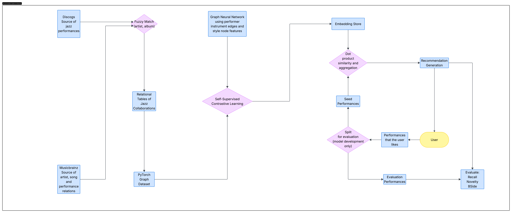

# Jazz Graph

1. Visualize the graph in places.
2. Flow chart (System overview)
3. Results table.
4. Data tables (nodes etc.)

## System Architecture

The JazzGraph system includes a data pipeline (left), machine learning system (middle) and a recommendation system (right side). The ML system provides embeddings representing the similarity of jazz musical performances. The recommender uses these embeddings to generate recommendations.

## Jazz Collaboration for Recommendation

This project leverages collaboration with in jazz musical works to create a recommendation system. The main goals of the project are (1) to establish a large corpus of data about jazz music and collect that data in a graph format, (2) to develop a graph neural network that learns representation of jazz performances and (3) to evaluate a recommendation system which uses those representations to make recommendations.

Jazz music is highly collaborative. Jazz musicians collaborate directly when performing songs. Indirectly, jazz musicians play songs written by other jazz musicians. It is not an exaggeration to say that the most famous musicians in jazz from the 1950s and 1960s all played together at one time or another. It is fair to say the one could learn about new jazz simply starting with "Kind of Blue," the most famous and best selling jazz album of all time, and pick any artist on it to find another album of jazz. It is also not an exaggeration to say the the most famous jazz songs have all been played by the most famous jazz musicians, often several times. Jazz performances involve rearrangement, improvisation, and substantial novelty as well. Many famous jazz performances, such as John Coltrane's "My Favorite Things" are stylitstic reimaginings of the originals.

Jazz thus forms an elaborate social network and readily represnted as a graph. Analysis and modeling of graphs is an active area of computer science, mathematics and data science.

The aim to produce a recommender system based on jazz collaboration differs form many recommender system approaches in some ways.
1. The system uses features of the subject matter to produce representations of similarity that may be used for recommendation.
1. Music and other enteratinment content, in particular, have often relied on systems of aggregating knowledge and preference from human users to make recommendations. For example, collaborative filltering is often a matrix favorization problem where user-item interactions are the modeled data. In such a context, user-item interaction are either (1) a proxy for the domain features or (2) considered the primary target of represention. With 1, knowledge about musical similarity is assumed to be captured in user-item interactions. With 2, musiscal similarity is beside the point--the goal is learning something which represents something else, such as probabilities of user engagement. (We do not wish to overstate the reliance on user-item iteractions. It is well known that large enterainment services incorporate diverse sources of data in their recommender systems.)

JazzGraph takes a slightly different approach. It assumes that the subject domain contains sufficiently rich information that similarity can be encoded by learning from the domain's structure alone. In short, it assumes that a graph of artists, songs and performances is sufficiently rich that it is possible to learn representation of the domain sufficient to generate informed recommendations. In this regard, it is arguably more like human cognition regarding musical recommendation than collaborative filtering: human experts know the music and recommend music based on musical features; they don't (or many would be ashamed to admit to) making recommendations simply based on popularity and other's taste.
(Again, we should not exaggerate the point: knoweldge of who plays with whom is not the same as knowing a song. Nevertheless, it is knowledge of the subject domain, rather than (for example) user perferences. Another perspective on the present work is as an investigation of whether domain knowledge encoded in user preferences aligns with domain knowledge encoded in collaboration.)

## Data

### Data Model

We model jazz collaboration as a heterogenous graph. Within the graph, there are three primary entity types:
- Artists: people, primarily musicians who play songs. Additionally, composers of songs are included in the graph even when they are not also performers. Examples include Duke Ellington and John Coltrane.
- Songs: particular musical compositions that artists perform. Examples include "Take the A Train" and "My Favorite Things."
- Performances: events where musicians (or a single musican) play a song. Live performances and studio recording sessions are both performances.

(While our data about performances is captured in the published recordings of performances, it is important to distinguish a performance from a release. A release is a particular publication of a performance. A recording of a performance may be released and re-released numerous times, as, for example, when many record labels re-released their recordings on CD in the 1980s and 1990s.)

* Relations
* Features

### Data Sources

To complete the project, it was necessary to extract the data about jazz collaborations from publicly available sources.

Musicbrainz is a large public SQL database of musical recordings. It contains detailed information, including songs and performers, for many of the recordings in the catalog. It lacks two keys components needed for this project. A concept of a master recording or release that organizes re-released recordings under a single parent. (As an example, recordings released on CD in the 1980s and a vinyl release of the same from the 1950s to not share a single parent id.) Additionally, Musicbrainz does not have style or genre information which isolates jazz recordings from other genres. Musicbrainz is a publicly maintained database and therefore contains inconsistencies that result from imperfect governance of the data.

Discogs is makes available XML files of its data. There are two XML files in Discogs of interest for this project. First, the releases table in Discogs includes the a parent object which duplicate releases share. Second, it contains data on releases themselves, including artist, trakclistings, and genres. Discogs does not have the two major weaknesses of Musicbrainz.  However, the data is not organized into relational tables. Thus, performers associated with a recording are not linked to a table with unique entries for each artist; instead, a release will indicate who played on it with string data. This means that it is difficult to reliably build performance edges for the graph.

To build the graph of jazz collaboration, we thus need to merge these two data sources by fuzzy matching on artist and title strings. In summary, this means identifying Discogs jazz master recordings and matching the earliest release in Musicbrainz with the same album title and artist name. This allows one to construct a table of jazz recordings in Musicbrainz and then use that database to construct the performing and performs edges.

### Process

A. Combine the sources finding the first known example of all recording_ids in Musicbrainz and selecting distinct records ordered by ascending release date. These rows were fuzzy matched by normalizing album title and artist name and aligning to the known jazz recordings in Discogs. These recording ids were added to a junction table and the relevant Discogs were added to a separate table. From this, a stable view of the jazz recordings can be read from the database.

Despite the simplicity of the plan, there were a number of iterations on this process. To ensure that the result of the data deduplicated relevant rows, did not have nulls values, was properly column sorted, I created schemas in Pandera to valid data before loading it. To prevent potential issues where the state of the database might be unclear, I prevented writing code to the database except when the working tree was clean, and I logged (in the database) the DDL and DML queries run against it. As a result, it is possible know

### Summarize

What the remains? How many nodes? How many edges? Etc.

Features? (Maybe just discuss features with training, since you mostl)

### "Issues"

Maybe not the best term, but acknowledge data quality in source material, effects of fuzzy matching and other matters of the overall graph quality.

i. Potential for duplicate records (nodes).
ii. Potential for missing records (missing nodes, missing edges).
iii. Potential for incomplete information (missing edges, incomplete node attributes).
iv. Combinations of effects: where a node is duplicated, a portion of relevant edges may direct to either of the nodes.

## Modeling

### GNN Approaches and Challenges

There are a number of models for GNN learning. The basic approach of all GNNs is to characterize graph nodes with their feature information; the feature information can be features from the data, learned features (i.e, embeddings) or a combination of these. The process of learning about the graph involves learning a representation of a node with its neighborhood. For example, the GraphSAGE algorithm learns a representation $h_1$ of a nodes neighborhood by transforming the feature representation of a node and it's neighbors with a learned transformation and then aggregating these to a representation of the node's neighborhood. Through additional layers, a representaiton of a node, its neighbors, and it's neighbors' neighbors can be learned. Roughly:
$$h_{x1} = agg(W_1.x_i)$$
where $W_1$ is the learned weight matrix, $N_x$ is the set of nodes that are neighbors of $x$, adn $agg$ is an aggregation function, such as summation. In more sophistocated models, the aggregation can be informed by features of edges, which (of course) determine which nodes are connected to $x_i$.

The goal of the Graph Neural Network (GNN) is to learn representations of musical performances from the graph of collaboration.
The representations will be used in the downstream recommendation task. Thus, it is necessary to find a task for learning representations which generates a useful concept of similarity. Following standard deep learning practice, all the approaches for this I considered involved learning an embedding to capture the latent space which characterizes the features for learning.

There are many options for such a task, though the available data limits what might be done. Task are naturally divided into two classes, supervised and unsupervised (or self-supervised) models.

One feature available for supervised learning is the jazz substyle information in the graph. Each performance has a multilabel feature corresponding to the jazz sub-style(s) it exemplifies. One advantage of using this data is that music style presumably directly correlates to listener preferences, so that a listen who likes a lot of bebop would presumbaly like other songs which are also bepop. With this in mind, the first version of the model that I built learned embeddings to classify performances according to style. This model did poorly in the B-side experiment task (see below.) There are a few likely reasons why this model did not succeed. First is that the loss function did not constrain the node embeddings into a space where the dot product or cosine similarity represented degree of similarity between two performances. Second, the style information itself seems incomplete (many performances have no substyle.) Finally, the styles maybe too coarse to learn embeddings the helpfully differentiate in a spectrum of similarity. In the future work section below, I suggest addition ways the label information might be used to learn, directly, when two performances are similar.

Many recommendations systems use graphs, which are a natural extension of matrix factorizations problems in collaborative filtering. In those problems, an item and query have an edge between them if an appropriate interaction exists. For example, in movie recommendation, a user and a movie might be linked if the user gave the movie a positive review. In the graph context, the probability of a link between an item and query can be used to order items for recommendation. With this in mind, I also tried some link prediction tasks; two performances are similar if they share similar probability distributions over actual and hypothetical links. I invetigated two potential link prediction tasks; first, performance-artist links, second, performance-album links. in both cases, the model also did poorly on the B-side exerperiment and recommendation task. But, the model was exceptionally good at finding the links. Indeed, that I spent a fair amount of time confirming that there was not leakage to the dev set because perfect prediction is often a symptom of leakage rather than model quality. Leakage is a common problem in link prediction learning for graphs beacuse information can "sneak" along edges in subtle ways, including reverse edges of undirected graphs. Leakage was not the sources of the problem--the issue appears to be that certain links are just too easy to predict with enough information. (A common feature of our jazz graph is that two performances on the same album will share exactly the same artists, making the artists in one performance exceptional signal about the artists in another. Random samples of negative edges must be carried out very carefully to make the task informative enough to be challenging.) The combination of high performance on these training tasks but low performance on the downstream recommendation metrics suggests that the task is inappropraite to learning useful embeddings.

A self-supervised task for graph learning is also promising. In self-supervized learning tasks, a model is required to predict the graph structure itself. This is similar to token prediction tasks used to learn embeddings for words. For practical reasons, mostly relating to the code already engineered for the two supervised learning tasks, I decided to use a version of SimCLR for self-supervised learning. SimCLR was originally applied to image learning. A SimCLR model involves learning are representaiton h of an entity one seeks to represent and a represntation z used for the training task. The training task in SimCLR involves created two augmented views of each sample and then learning to identify (1) which samples are augmentations of the same entity and (2) to spread the representations of different entities uniformly in the embedding space.

I tried two different augmentation approaches. First, an edge ablation task where random edges are removed from the graph. Second, a shared album task where two performances should have similar representations if they are on the same album. In some ways, these are similar to the edge prediction task. However, they add a component of contrasitve learning. (EXPAND?)

Self-supervised learning resulted in performance embeddings that succeeded in the recommendation task, both for B-side and Spotify recommendations.

### Training and Model Architecture

In order to train on a large graph, it is necessary to sample the graph. Sampling is accomplished by ordering the nodes in a batch and then completing a random walk of constrained depth around each node in the batch. Initial attempts for random odering of nodes resulted in no learning, however, this was traced back to extreme sparsity in the sampled graphs--placing recordings from the 1940 and 2020s in the same sample meant almost no relevant connection between nodes. A simple solution to this problems to add a jitter to the release year for each node at the start of each epoch and then order by this jittered year. This eliminated the sparsity problem and models were able to successfully learn from the jittered samples.

The minimum layer depth for learning from jazz collaborations is 2. Each performance node should learn not only from the features of artist who played on them but also from that artists performance neighborhood. In the collaboration graph, there are no direct performance-performance edges: to reach one performance from another, it is necesssary to pass through an artist or song node. To reach a performance node from a perfromance node while moving through a song node we also need two hops. I selected a layer depth of three, allowing a more rich collection of graph information to reach each performance representation. I did not perform experiements to verify this decision, which remains for future work.

Models were trained without any informative features ("no feature models") and with two potentially important available features, the substyle information and an edge feature representing the instrument played ("with features.") In the no feature models each layer was a GraphSAGE convoluation with 64 dimensional outputs. In the feature models, an attentional layer was used since SAGE models don't natively support edge features. Adding features to the model provided a significant boost to performance.

## Recommendation

Recommenders need to translate a collection of seed value into a collection of scored recommendations.

A recommender finds the dot product off all known performances with the embeddings of the seed performances, creating an n x m matrix, n = number of known recordings, m = number of seed recommendations. Each row, then, represents a single recording and it's similarity to all seed listing values. A score for each recording is generated by aggregating these scores.

I experimented with three different aggregation functions, sum, max and softmax. Summation weights all performances in the seed value equally; conceptually, this can be seen as promoting recommendations which are like the mean seed. To clarify this effect, imagine that the embedding primarily characterize whether a song is bebop or modal jazz; then, if 80% of all seeds are bebop, we would expect bepob performances to score highly while model performances score weakly, since the model performances will be similar to only 20% of seeds and each seed is equally weight. Max aggregation promotes performances which are highly similar to exactly one seed value. Conceptually, if some performances are avant-guard and avant-gaurd performances are highly similar to one another whie others are hard bop and hard bop performances tend to be just somewhat similar to one another, max aggregation will have tendency to promote avant-guard recordings even if only a small proportion of seeds are avant-gaurd. Softmax aggregation takes each row of per-seed scores and weights it by the softmax of the row and then sums the score. The effect is upsignaling performances that are highly similar to some seed value, and this may be seen as balancing the tendencies of max and sum aggregation.

Given an input model, how do we turn model outputs into a recommendation?

Also, two baselines.

## Evaluation and Results

We evaluate the quality of the recommendations by relevance and diversity. There is direct measure for a self-supervised task to assess whether it generates relevant recommendations. As a proxy, I used my own Spotify listening history. First, we split the listening history by album so that performances on an album are split between two sets. The reason for album spliting is straightforward: given that two songs are on the same album, it is almost trivial to know that I should recommend any unseeded performances that share an album with a seeded performance. The task is significantly more challenging if the system needs to understand that performance from different albums, which are more likely to be disjoint in some features, are similar.

What are the procedures for evaluation? Why use those?

Provide a table of results for the baselines and the models that were trained

<table border="1" class="dataframe">
  <thead>
    <tr style="text-align: right;">
      <th></th>
      <th>model</th>
      <th>pooling</th>
      <th>novel_recall</th>
      <th>familiar_recall</th>
      <th>coverage</th>
      <th>BSide_mean_MAP_at_k</th>
    </tr>
  </thead>
  <tbody>
    <tr>
      <th>7</th>
      <td>match_album_no_features</td>
      <td>max</td>
      <td>0.173428</td>
      <td>1.000000</td>
      <td>0.835570</td>
      <td>0.345939</td>
    </tr>
    <tr>
      <th>12</th>
      <td>RandomWalkRecommender</td>
      <td>---</td>
      <td>0.194444</td>
      <td>0.202899</td>
      <td>0.523611</td>
      <td>0.132113</td>
    </tr>
    <tr>
      <th>4</th>
      <td>edge_ablation_with_features</td>
      <td>max</td>
      <td>0.239351</td>
      <td>1.000000</td>
      <td>0.917030</td>
      <td>0.000000</td>
    </tr>
    <tr>
      <th>0</th>
      <td>dual_loss_with_features</td>
      <td>sum</td>
      <td>0.276876</td>
      <td>0.328924</td>
      <td>0.806652</td>
      <td>0.822443</td>
    </tr>
    <tr>
      <th>2</th>
      <td>dual_loss_with_features</td>
      <td>softmax</td>
      <td>0.276876</td>
      <td>0.318342</td>
      <td>0.807520</td>
      <td>0.822443</td>
    </tr>
    <tr>
      <th>6</th>
      <td>match_album_no_features</td>
      <td>sum</td>
      <td>0.278905</td>
      <td>0.378307</td>
      <td>0.850870</td>
      <td>0.434394</td>
    </tr>
    <tr>
      <th>10</th>
      <td>match_album_with_features</td>
      <td>max</td>
      <td>0.295132</td>
      <td>1.000000</td>
      <td>0.829692</td>
      <td>0.523511</td>
    </tr>
    <tr>
      <th>1</th>
      <td>dual_loss_with_features</td>
      <td>max</td>
      <td>0.297160</td>
      <td>1.000000</td>
      <td>0.840242</td>
      <td>0.839110</td>
    </tr>
    <tr>
      <th>8</th>
      <td>match_album_no_features</td>
      <td>softmax</td>
      <td>0.314402</td>
      <td>0.395062</td>
      <td>0.840242</td>
      <td>0.411335</td>
    </tr>
    <tr>
      <th>3</th>
      <td>edge_ablation_with_features</td>
      <td>sum</td>
      <td>0.314402</td>
      <td>0.365961</td>
      <td>0.910978</td>
      <td>0.000000</td>
    </tr>
    <tr>
      <th>5</th>
      <td>edge_ablation_with_features</td>
      <td>softmax</td>
      <td>0.323529</td>
      <td>0.393298</td>
      <td>0.910840</td>
      <td>0.000000</td>
    </tr>
    <tr>
      <th>13</th>
      <td>ArtistWeightedRecommender</td>
      <td>---</td>
      <td>0.420455</td>
      <td>0.405125</td>
      <td>0.011527</td>
      <td>0.000000</td>
    </tr>
    <tr>
      <th>9</th>
      <td>match_album_with_features</td>
      <td>sum</td>
      <td>0.485801</td>
      <td>0.544092</td>
      <td>0.805335</td>
      <td>0.548604</td>
    </tr>
    <tr>
      <th>11</th>
      <td>match_album_with_features</td>
      <td>softmax</td>
      <td>0.518256</td>
      <td>0.608466</td>
      <td>0.804558</td>
      <td>0.548604</td>
    </tr>
  </tbody>
</table>

## Future Projects
